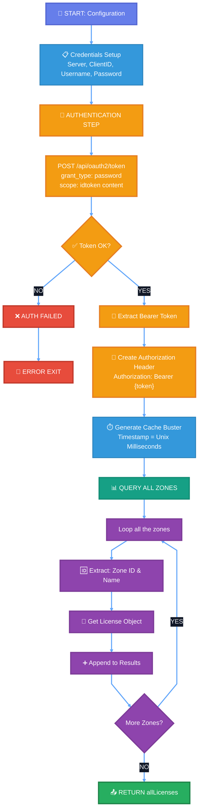

# Liquit REST API Workflow

## OAuth2 Authentication & Zone License Query Flow



## Key API Concepts Visualized

### 🔑 Authentication Flow
```
┌─────────────────────────────────────────────┐
│   User Credentials                          │
│   ├─ username: local\admin                  │
│   ├─ password: ****                         │
│   └─ client_id: 74AAE62C-58BE-...          │
└────────────┬────────────────────────────────┘
             │
             ▼
┌─────────────────────────────────────────────┐
│   OAuth2 Token Endpoint                     │
│   POST /api/oauth2/token                    │
│   ├─ grant_type: password                   │
│   └─ scope: idtoken content                 │
└────────────┬────────────────────────────────┘
             │
             ▼
┌─────────────────────────────────────────────┐
│   Access Token Received ✅                   │
│   token_type: Bearer                        │
│   expires_in: 3600                          │
│   access_token: eyJ0eXAi...                │
└────────────┬────────────────────────────────┘
             │
             ▼
┌─────────────────────────────────────────────┐
│   Authorization Header                      │
│   Authorization: Bearer eyJ0eXAi...        │
│   (Used for all API calls)                  │
└─────────────────────────────────────────────┘
```

### 🔍 OData Query Parameters
| Parameter | Purpose | Example |
|-----------|---------|---------|
| **$count=true** | Include total count in response | Enables pagination info |
| **$skip=0** | Pagination: Skip N records | Skip first 0 records |
| **$top=50** | Pagination: Return max N records | Return max 50 per request |
| **$orderby=name** | Sort results | Sort by name ascending |
| **$select=id,name,...** | Select specific fields | Reduces response payload |
| **_=timestamp** | Cache buster | Force fresh data each call |

### 🔄 Loop Through All Zones
```
FOR EACH zone:
  ├─ Extract Zone ID & Name
  ├─ GET /api/v3/system/zones/{zoneId}/?$select=id,license
  ├─ Retrieve License Object
  └─ Append to Results Array
RETURN allLicenses
```

## 📦 Data Structure Flow

### Step 1: Authentication Response
```json
{
  "access_token": "eyJ0eXAiOiJKV1QiLCJhbGc...",
  "token_type": "Bearer",
  "expires_in": 3600,
  "scope": "idtoken content"
}
```

### Step 2: Query Zones (Simplified)
```json
{
  "@odata.count": 15,
  "value": [
    {
      "id": "ee840dbe-df14-6ef9-0002-375cae35752b",
      "name": "Production Zone",
      "enabled": true,
      "primary": true,
      "license/state": "Active"
    },
    ...
  ]
}
```

### Step 3: Enriched Results (Loop Through Zones)
```powershell
@(
  @{
    ZoneId   = "ee840dbe-df14-6ef9-0002-375cae35752b"
    ZoneName = "Production Zone"
    License  = @{
      state   = "Active"
      expires = "2025-12-31"
      ...
    }
  },
  @{
    ZoneId   = "12345678-abcd-ef12-3456-789abcdef012"
    ZoneName = "Staging Zone"
    License  = @{
      state   = "Active"
      expires = "2025-06-30"
      ...
    }
  }
)
```

## 💻 PowerShell Usage Examples

### Run Script & Capture Results
```powershell
# Execute script and store results
$licenses = .\restapi-blog.ps1

# View all license data
$licenses | Format-Table -AutoSize

# Export to CSV
$licenses | Select-Object ZoneName, License | Export-Csv zones-licenses.csv -NoTypeInformation

# Filter specific zones
$licenses | Where-Object { $_.ZoneName -like '*Production*' }

# Check license expiration
$licenses | Select-Object ZoneName, @{Name='Expires'; Expression={$_.License.expires}} | Sort-Object Expires
```

### Process Results Directly
```powershell
# Store and process in one line
$licenses = .\restapi-blog.ps1 | ForEach-Object {
    Write-Host "Zone: $($_.ZoneName) | License: $($_.License.state)"
    $_
}
```

### Error Handling
```powershell
try {
    $data = .\restapi-blog.ps1
    Write-Host "✅ Successfully retrieved $($data.Count) zones" -ForegroundColor Green
}
catch {
    Write-Error "❌ Failed to fetch zones: $_"
}
```
