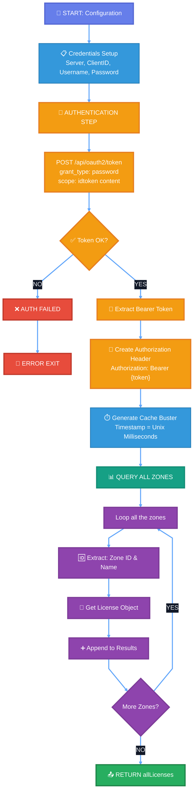
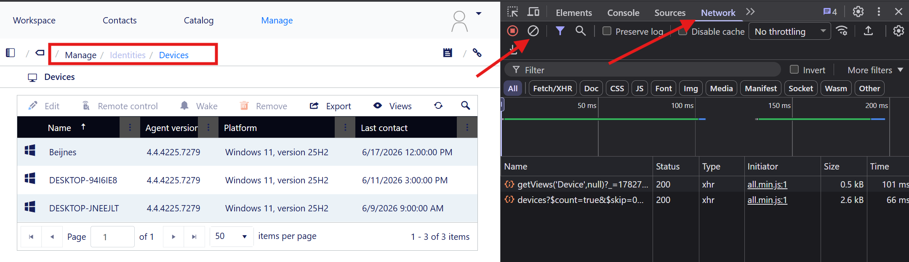
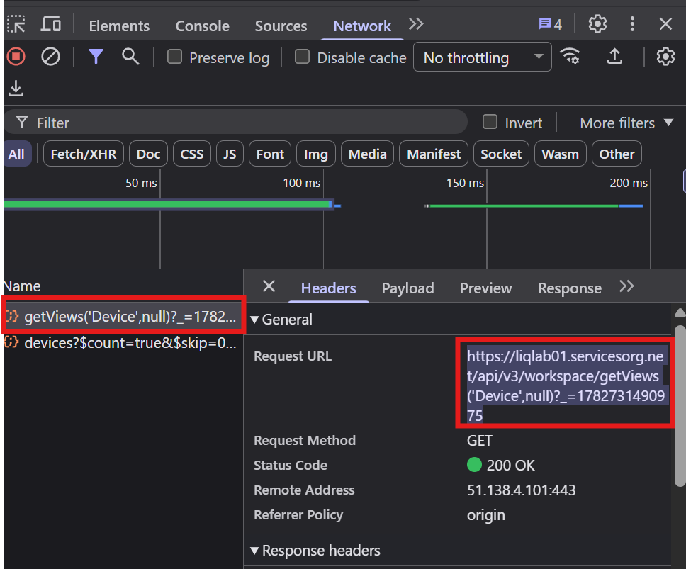

# Using REST API to Build a Recast Application Workspace License Report with GitHub Copilot

> A practical field story from End User Computing: from zero REST API and OAuth knowledge to a working reporting script.

## About Me

I’m Roel Beijnes, Senior Consultant for End User Computing at Previder. With a strong background in application delivery technologies, including MSI packaging, App-V, ThinApp, and VMware App Volumes, I specialize in designing and optimizing modern application delivery strategies.

Leveraging this background, I was asked to co-develop and onboard our Managed Application Delivery Service. Today, I’m proud to own this service as Product Owner, driving its roadmap and ensuring it continues to evolve with the needs of our customers.


## Why I Started This

Recast Software provides a PowerShell module as the officially supported way to interact with Recast Application Workspace. Their goal is to cover most actions available in the portal, but there are still gaps — especially when you want to automate or integrate deeper functionality.

Together with my colleague Ivan de Mes, I started exploring the underlying REST API to see how far we could push it. Our biggest challenge was obtaining a valid access token, and getting OAuth authentication to work wasn’t straightforward.

With help from Copilot and additional information provided by Recast Software with the JavaScript reference at
https://api.liquit.com/workspace/v2/liquit.workspace.js — I managed to build a working script that retrieves an OAuth access token. Once we had that token, the REST API opened up and we were finally able to experiment with endpoints beyond what the PowerShell module currently supports.

This gives us a lot more flexibility and allows us to automate scenarios that weren’t possible before.

## Why I Created This Blog

In my conversations with Recast Software, Donny van der Linde expressed the need for more comprehensive license information from partners and customers. The existing PowerShell module provides only limited data, which makes it difficult to obtain a complete overview.

Because I had previously shared how I use GitHub Copilot to simplify REST API work, Donny asked me to look into retrieving the missing license information through the Recast Application Workspace API. Based on my earlier experience with similar integrations, I was able to achieve this within an hour, with Copilot assisting in several of the more repetitive or detailed steps.

This assignment reminded me how much I appreciate working through practical technical challenges, and it motivated me to document the results. I wanted to ensure the effort was recognized and to share the outcome with peers who may benefit from it. It also provides a good opportunity to demonstrate how AI-assisted tooling can support our daily work and help us approach tasks more efficiently. Due to limited time and energy, this blog was created with Copilot and edited by Roel Beijnes.

## Important Support Note

Using the Recast Application Workspace REST API directly is not a supported practice for customer support scenarios.

For supported automation and supportability, use the official PowerShell module from Recast Software:

- `Liquit.Server.Powershell`

This blog is about exploration and learning, not replacing the supported path.


## OAuth2 Authentication & Zone License Query Flow



## Key API Concepts Visualized

### 🔑 Authentication Flow
```
┌─────────────────────────────────────────────┐
│   User Credentials                          │
│   ├─ username: local\admin                  │
│   ├─ password: ****                         │
│   └─ client_id: 74AAE62C-58BE-...          │
└────────────┬────────────────────────────────┘
             │
             ▼
┌─────────────────────────────────────────────┐
│   OAuth2 Token Endpoint                     │
│   POST /api/oauth2/token                    │
│   ├─ grant_type: password                   │
│   └─ scope: idtoken content                 │
└────────────┬────────────────────────────────┘
             │
             ▼
┌─────────────────────────────────────────────┐
│   Access Token Received ✅                   │
│   token_type: Bearer                        │
│   expires_in: 3600                          │
│   access_token: eyJ0eXAi...                │
└────────────┬────────────────────────────────┘
             │
             ▼
┌─────────────────────────────────────────────┐
│   Authorization Header                      │
│   Authorization: Bearer eyJ0eXAi...        │
│   (Used for all API calls)                  │
└─────────────────────────────────────────────┘
```

### 🔍 OData Query Parameters
| Parameter | Purpose | Example |
|-----------|---------|---------|
| **$count=true** | Include total count in response | Enables pagination info |
| **$skip=0** | Pagination: Skip N records | Skip first 0 records |
| **$top=50** | Pagination: Return max N records | Return max 50 per request |
| **$orderby=name** | Sort results | Sort by name ascending |
| **$select=id,name,...** | Select specific fields | Reduces response payload |
| **_=timestamp** | Cache buster | Force fresh data each call |

### 🔄 Loop Through All Zones
```
FOR EACH zone:
  ├─ Extract Zone ID & Name
  ├─ GET /api/v3/system/zones/{zoneId}/?$select=id,license
  ├─ Retrieve License Object
  └─ Append to Results Array
RETURN allLicenses
```

## Step-by-Step: How I Built the Calls

### Technologies Used

- REST API for direct endpoint communication with Recast Application Workspace
- OAuth2 password grant for authentication and bearer token retrieval
- OData query parameters for filtering, sorting, and paging API responses
- PowerShell `Invoke-RestMethod` for HTTP requests and JSON parsing
- Cache-busting query parameter (`_`) to avoid stale browser/proxy responses

### 1. Authenticate with OAuth2 (Password Grant)

The first step is obtaining an access token from the OAuth2 token endpoint. In PowerShell, this is done with a form-encoded POST request:

```powershell
$tokenResponse = Invoke-RestMethod `
	-Method POST `
	-Uri "$server/api/oauth2/token" `
	-ContentType 'application/x-www-form-urlencoded' `
	-Body @{
		grant_type = 'password'
		client_id  = $clientId
		scope      = 'idtoken content'
		username   = $username
		password   = $password
	}
```

### 2. Extract the Access Token and Build Auth Header

After successful authentication, the script reads the `access_token` and injects it into an Authorization header for all next requests:

```powershell
$token = $tokenResponse.access_token
$headers = @{ Authorization = "Bearer $token" }
```

### 3. Query Zones with OData Parameters

To keep responses efficient and predictable, I used OData parameters such as `$count`, `$top`, `$orderby`, and `$select`:

```powershell
$cacheBuster = [DateTimeOffset]::UtcNow.ToUnixTimeMilliseconds()
$uri2 = "$server/api/v3/system/zones?`$count=true&`$skip=0&`$top=50&`$orderby=name&`$select=id,name,enabled,primary,license/state,virtualHost,license/expires&_=$cacheBuster"
$zonesResponse = Invoke-RestMethod -Method GET -Uri $uri2 -Headers $headers
$allZones = $zonesResponse.value
```

This call retrieves the zone list and basic license-related fields while minimizing payload size.

### 4. Loop Zones and Retrieve Detailed License Data

For each zone, I make a second API call to fetch detailed license information:

```powershell
foreach ($zone in $allZones) {
	$zoneId = $zone.id
	$cacheBuster = [DateTimeOffset]::UtcNow.ToUnixTimeMilliseconds()
	$uri3 = "$server/api/v3/system/zones/$zoneId/?`$select=id,license&_=$cacheBuster"
	$zoneDetail = Invoke-RestMethod -Method GET -Uri $uri3 -Headers $headers

	$licenseObject = [pscustomobject]@{
		ZoneId   = $zoneDetail.id
		ZoneName = $zone.name
		License  = $zoneDetail.license
	}

	$allLicenses += $licenseObject
}
```

### 5. Return Structured Objects for Reporting

The script returns `$allLicenses`, a structured object collection that is easy to export, filter, and reuse in reporting pipelines.

In short: authenticate once, query the zone collection, enrich per zone, and return normalized PowerShell objects.

## How to Discover REST Endpoints Yourself

One very practical technique is to inspect network traffic in the portal and read the actual URL and payload of each click.

In **Brave**, this looks like:

1. Open the Recast Application Workspace portal.
2. Press `F12`.
3. Go to **Network** and clear the network history.



4. Perform the UI action you want to automate.
5. Inspect URL, method, headers, and payload.
6. Paste those details into Copilot and ask for a PowerShell equivalent.



For other browsers, the screens are different, but the method is the same: inspect requests, understand payloads, then translate them into script calls.

## Final Outcome

Using this approach, I created a script that:

- Authenticates against Recast Application Workspace
- Retrieves zones
- Pulls license details per zone
- Returns reusable PowerShell objects for reporting and automation

Script source: [restapi-blog.ps1](RestAPI/restapi-blog.ps1)


The main gain was not just script output, but a repeatable method to learn and build quickly with AI assistance.

If your background is packaging and platform operations instead of API engineering, you can still make meaningful progress.

Start small, validate one call at a time, and use Copilot as a technical translator between portal behavior and script implementation.


