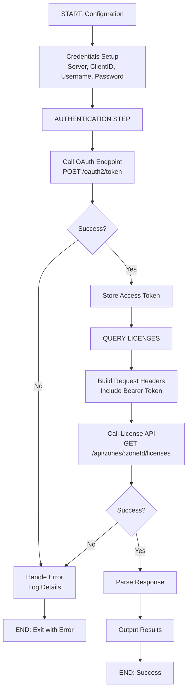

> A practical field story from End User Computing: from zero REST API and OAuth knowledge to a working reporting script.

## About Me

I'm Roel Beijnes, Senior Consultant for End User Computing at Previder. With a strong background in application delivery technologies, including MSI packaging, App-V, ThinApp, and VMware App Volumes, I specialize in designing and optimizing modern application delivery strategies.

Leveraging this background, I was asked to co-develop and onboard our Managed Application Delivery Service. Today, I'm proud to own this service as Product Owner, driving its roadmap and ensuring it continues to evolve with the needs of our customers.

## Why I Started This

Recast Software provides a PowerShell module as the officially supported way to interact with Recast Application Workspace. Their goal is to cover most actions available in the portal, but there are still gaps — especially when you want to automate or integrate deeper functionality.

Together with my colleague Ivan de Mes, I started exploring the underlying REST API to see how far we could push it. Our biggest challenge was obtaining a valid access token, and getting OAuth authentication to work wasn't straightforward.

With help from Copilot and additional information provided by Recast Software with the JavaScript reference at https://api.liquit.com/workspace/v2/liquit.workspace.js — I managed to build a working script that retrieves an OAuth access token. Once we had that token, the REST API opened up and we were finally able to experiment with endpoints beyond what the PowerShell module currently supports.

This gives us a lot more flexibility and allows us to automate scenarios that weren't possible before.

## Why I Created This Blog

In my conversations with Recast Software, Donny van der Linde expressed the need for more comprehensive license information from partners and customers. The existing PowerShell module provides only limited data, which makes it difficult to obtain a complete overview.

Because I had previously shared how I use GitHub Copilot to simplify REST API work, Donny asked me to look into retrieving the missing license information through the Recast Application Workspace API. Based on my earlier experience with similar integrations, I was able to achieve this within an hour, with Copilot assisting in several of the more repetitive or detailed steps.

This assignment reminded me how much I appreciate working through practical technical challenges, and it motivated me to document the results. I wanted to ensure the effort was recognized and to share the outcome with peers who may benefit from it. It also provides a good opportunity to demonstrate how AI-assisted tooling can support our daily work and help us approach tasks more efficiently.

## Important Support Note

Using the Recast Application Workspace REST API directly is not a supported practice for customer support scenarios.

For supported automation and supportability, use the official PowerShell module from Recast Software:

- `Liquit.Server.Powershell`

This blog is about exploration and learning, not replacing the supported path.

## OAuth2 Authentication & Zone License Query Flow



## The PowerShell Script

Below is the complete script that handles OAuth authentication and retrieves license data:

```powershell
# Recast Application Workspace REST API - License Report
# Author: Roel Beijnes with GitHub Copilot
# Description: Retrieves license information from Recast Application Workspace via REST API

param(
    [Parameter(Mandatory = $true)]
    [string]$Server,
    
    [Parameter(Mandatory = $true)]
    [string]$ClientID,
    
    [Parameter(Mandatory = $true)]
    [string]$Username,
    
    [Parameter(Mandatory = $true)]
    [string]$Password
)

# Suppress SSL certificate warnings for self-signed certificates (use with caution)
if ($PSVersionTable.PSVersion.Major -eq 5) {
    [System.Net.ServicePointManager]::SecurityProtocol = [System.Net.ServicePointManager]::SecurityProtocol -bor 3072
}

# Step 1: Obtain OAuth Access Token
function Get-OAuthAccessToken {
    param(
        [string]$Server,
        [string]$ClientID,
        [string]$Username,
        [string]$Password
    )
    
    $tokenEndpoint = "https://$Server/oauth2/token"
    
    $body = @{
        grant_type    = "password"
        client_id     = $ClientID
        username      = $Username
        password      = $Password
        scope         = "workspace"
    } | ConvertTo-Json
    
    try {
        $response = Invoke-RestMethod -Uri $tokenEndpoint `
            -Method Post `
            -Headers @{ "Content-Type" = "application/json" } `
            -Body $body `
            -ErrorAction Stop
        
        return $response.access_token
    }
    catch {
        Write-Error "Failed to obtain OAuth token: $_"
        exit 1
    }
}

# Step 2: Retrieve Zones
function Get-Zones {
    param(
        [string]$Server,
        [string]$AccessToken
    )
    
    $zonesEndpoint = "https://$Server/api/zones"
    $headers = @{ "Authorization" = "Bearer $AccessToken" }
    
    try {
        $response = Invoke-RestMethod -Uri $zonesEndpoint `
            -Method Get `
            -Headers $headers `
            -ErrorAction Stop
        
        return $response
    }
    catch {
        Write-Error "Failed to retrieve zones: $_"
        exit 1
    }
}

# Step 3: Retrieve Licenses for a Zone
function Get-ZoneLicenses {
    param(
        [string]$Server,
        [string]$ZoneID,
        [string]$AccessToken
    )
    
    $licensesEndpoint = "https://$Server/api/zones/$ZoneID/licenses"
    $headers = @{ "Authorization" = "Bearer $AccessToken" }
    
    try {
        $response = Invoke-RestMethod -Uri $licensesEndpoint `
            -Method Get `
            -Headers $headers `
            -ErrorAction Stop
        
        return $response
    }
    catch {
        Write-Error "Failed to retrieve licenses for zone $ZoneID : $_"
        return $null
    }
}

# Main Script
Write-Host "Starting Recast Application Workspace License Report..."

# Get OAuth Token
$accessToken = Get-OAuthAccessToken -Server $Server -ClientID $ClientID -Username $Username -Password $Password
Write-Host "✓ Successfully obtained OAuth access token"

# Get Zones
$zones = Get-Zones -Server $Server -AccessToken $accessToken
Write-Host "✓ Retrieved $($zones.Count) zones"

# Process each zone
$allLicenses = @()
foreach ($zone in $zones) {
    Write-Host "Processing zone: $($zone.Name) (ID: $($zone.ID))"
    
    $licenses = Get-ZoneLicenses -Server $Server -ZoneID $zone.ID -AccessToken $accessToken
    
    if ($licenses) {
        $licenses | ForEach-Object {
            $allLicenses += [PSCustomObject]@{
                Zone         = $zone.Name
                ZoneID       = $zone.ID
                LicenseType  = $_.Type
                Status       = $_.Status
                ExpiryDate   = $_.ExpiryDate
                Devices      = $_.DeviceCount
                Created      = $_.CreatedDate
            }
        }
    }
}

# Output Results
$allLicenses | Format-Table -AutoSize
$allLicenses | Export-Csv -Path "LicenseReport_$(Get-Date -Format 'yyyyMMdd_HHmmss').csv" -NoTypeInformation

Write-Host "✓ License report completed"
```

## Key Takeaways

1. **OAuth2 Flow**: The password grant type is the most straightforward for automated scenarios, though not recommended for user-facing applications
2. **Token Management**: Always store tokens securely and implement refresh token logic for long-running scripts
3. **Error Handling**: Always wrap API calls in try-catch blocks to handle network issues and authentication failures
4. **Documentation**: The JavaScript reference provided insights into the API structure that PowerShell documentation didn't cover
5. **AI Assistance**: GitHub Copilot significantly reduced development time for repetitive tasks and boilerplate code

## Next Steps

- Implement token refresh logic for extended operations
- Add comprehensive logging and audit trails
- Create additional functions for other API endpoints
- Consider implementing a local cache for frequently accessed data

---

*This blog post was created with assistance from GitHub Copilot and reviewed by Roel Beijnes. For questions or discussions, feel free to reach out on LinkedIn.*
